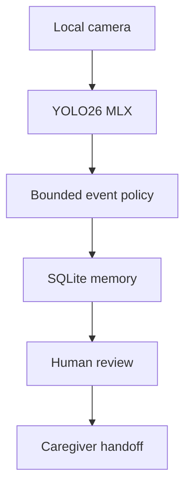

<p align="center">
  
</p>

# CareSight Hub

CareSight Hub is a local-first caregiver awareness system for homes where peace of mind matters: an aging parent living alone, a child at home, a pet, or any loved one you want to know is okay without turning the home into a cloud surveillance product.

The long-term vision is simple: a small Mac mini-class appliance that runs local vision, text-to-speech, and language models, records structured care events, preserves a non-destructive SQLite blackbox, and creates caregiver handoff paths when attention may be needed.

CareSight does not try to replace a caregiver, diagnose a condition, or dispatch emergency services. It gives the home a local memory: what was observed, when it happened, what evidence exists, who reviewed it, what was journaled, and what draft alert or handoff was prepared.

The current hackathon build uses the project scaffold as the repo backbone for governance, contracts, quality gates, and agent-safe collaboration, then keeps the Python/MLX runtime in a separate app boundary.

CareSight is not a medical device, certified fall detector, alarm service, emergency dispatch product, or HIPAA-compliant clinical system. The MVP creates local care observations that authorized humans can acknowledge, confirm, or dismiss.

## Hackathon Demo

The current judged demo path lives in [`hackathon/README.md`](hackathon/README.md). Start there for the vertical demo cut, operator journey, proof trail, and current command path.

| Entry | Use it for |
| --- | --- |
| [`hackathon/README.md`](hackathon/README.md) | Demo story, current video slot, and judge/operator orientation |
| [`hackathon/DEMO_JOURNEY.md`](hackathon/DEMO_JOURNEY.md) | Step-by-step operator path for setup, running, and review |
| [`hackathon/AUDIT_DIGEST.md`](hackathon/AUDIT_DIGEST.md) | Proof receipts, validation boundaries, and remaining gates |
| [`docs/status/OPERATING_STATUS.md`](docs/status/OPERATING_STATUS.md) | Current feature status, completed tests, safe command classes, and remaining runtime gates |

<details>
<summary>Why CareSight exists</summary>

Many care moments are stressful because the people responsible for helping do not have continuity. They may not know when something happened, where someone was last seen, what they were wearing, whether an event was already reviewed, or what the next appropriate handoff should be.

CareSight is designed around that gap.

It acts like a local black box for care-relevant observations: raw video stays local, models run locally, SQLite remains the source of truth, and every event has an audit trail. The goal is not to create fear or automate authority. The goal is to preserve context so help is easier to coordinate when something feels wrong.

In a perfect-world product footprint, this runs on the lowest-cost practical Apple hardware, such as a Mac mini, and becomes a quiet home appliance for local care awareness.

</details>

<details>
<summary>Why local models</summary>

Caregiving data is deeply personal. A camera in the home can reveal routines, vulnerability, visitors, mobility changes, pets, children, sleep patterns, and moments of distress. CareSight is built around the idea that this context should belong first to the household, not to a remote platform.

The default architecture keeps raw video, structured events, review history, journal entries, and handoff records on locally owned hardware. Local vision, language, and text-to-speech models reduce the need to send sensitive home context to outside services, while SQLite preserves an inspectable blackbox record of what happened.

This does not make CareSight a privacy guarantee or compliance product by itself. It does make privacy a design constraint: minimize external dependencies, keep raw media local by default, make every event auditable, and require explicit human approval before sensitive handoffs leave the device.

</details>

<details>
<summary>Project ethos</summary>

CareSight is being built in public because trust, safety, privacy, and caregiving should be accessible to people who are willing to learn, assemble, and run local tools for their own families. The open-source hackathon build should be capable enough to help real households experiment with local-first care awareness without waiting for a commercial gatekeeper.

That does not mean every future product layer must be free or unmanaged. A sustainable CareSight business would likely focus on reliable packaging, installation, support, managed updates, hardware compatibility, caregiver workflows, and other value-added services. The baseline loop should remain understandable and inspectable: observe locally, create bounded events, ask humans to confirm, journal what happened, and preserve auditability.

</details>

<details>
<summary>License posture</summary>

CareSight Hub is licensed under `AGPL-3.0-only` for the public hackathon repository.

This posture is deliberate. The current runtime uses the `thewebAI/yolo-mlx` Git submodule under `apps/caresight-hub/vendor/yolo-mlx`, which is also licensed under `AGPL-3.0-only`. For the hackathon build, that keeps the local-first baseline open, inspectable, and reciprocal while still leaving room for future packaged services, support, managed updates, hardware compatibility work, and other value-added product layers.

See `LICENSE`, `NOTICE.md`, and `docs/legal/LICENSE_NOTES.md`.

</details>

## Current Ship Goal

Build the v1/v2 hackathon MVP:



$$
\text{CareSight loop} = \text{local observation} + \text{bounded policy} + \text{human review}
$$

<details>
<summary>Repo shape</summary>

- `contracts/`: canonical schemas, examples, lifecycle, and fail-closed behavior.
- `packages/core/`: TypeScript validation and contract enforcement helpers.
- `tests/`: shared local quality gate for governance and contracts.
- `apps/caresight-hub/`: bounded Python runtime for YOLO26 MLX, camera handling, SQLite, alerts, and dashboard work.
- `docs/`: project brief, architecture, hackathon docs, roadmaps, references, and the imported docs pack.

</details>

## Start Here

<details>
<summary>Local setup and validation commands</summary>

1. Clone with submodules:

```bash
git clone --recurse-submodules https://github.com/Vel-Labs/CareSight.git
cd CareSight
```

2. Read `AGENTS.md`.
3. Read `docs/getting_started.md`.
4. Read `docs/project/PROJECT_BRIEF.md`.
5. Read `docs/architecture/REPO_BOUNDARIES.md`.
6. Read `docs/roadmaps/CURRENT_STATE_AND_NEXT.md`.
7. Run the quality gate:

```bash
npm run install:local
npm run check
```

The npm gate validates scaffold structure, contract schemas/examples, TypeScript tests, and the current Python runtime skeleton.

For a local model demo machine, install the ignored runtime/model prerequisites:

```bash
python3 apps/caresight-hub/scripts/caresight_install_all.py
```

Then start the local no-send operator stack:

```bash
python3 apps/caresight-hub/scripts/caresight_stack_start.py
```

For the current recorded hackathon demo, use the judge/operator entrypoint:

- `hackathon/README.md`
- `hackathon/DEMO_JOURNEY.md`
- `hackathon/AUDIT_DIGEST.md`

</details>

## Roadmaps

- Hackathon plan: `docs/hackathon/hackathon_roadmap.md`
- Current hackathon entrypoint: `hackathon/README.md`
- Future product plan: `docs/roadmaps/future_roadmap.md`
- Operational next steps: `docs/roadmaps/CURRENT_STATE_AND_NEXT.md`
- Current operating status: `docs/status/OPERATING_STATUS.md`
- Local model operations: `docs/operations/local_model_operations.md`
- Imported docs pack: `docs/caresight_hub_docs_pack/`

### Potential Product Lanes

These are roadmap lanes, not readiness claims. Each lane keeps the same baseline: local-first observation, structured records, human review, and no autonomous emergency dispatch.

| Lane | Near-term implementation ideas | Product direction |
| --- | --- | --- |
| Home Care | local appliance setup, calibrated floor zones, local dashboard, household diary, privacy controls | A family-owned home awareness hub for one residence |
| Remote Caregiver Practice | caregiver roles, allowlisted alerts, acknowledgement, event-scoped screenshots, daily summaries | A bounded handoff layer for family caregivers, care workers, sitters, and helpers |
| Care Homes / Medical Facilities | multi-room configuration, staff handoff queues, retention policy, audit export, deployment/support tooling | A future operational workflow lane that would require stricter validation, policy review, and compliance work before real use |

## Safety Posture

CareSight events use language like `possible_floor_stay` and `medication_routine_likely_observed`. Vision alone must not confirm medication administration, diagnose a condition, or trigger autonomous emergency dispatch. Human confirmation is part of the product boundary.

<details>
<summary>What CareSight does not claim</summary>

- It is not a medical device.
- It does not claim HIPAA compliance.
- It does not autonomously dispatch emergency services.
- It does not confirm medication administration from vision alone.
- It does not make dashboards, agents, OBS, or generated text canonical truth.

</details>
