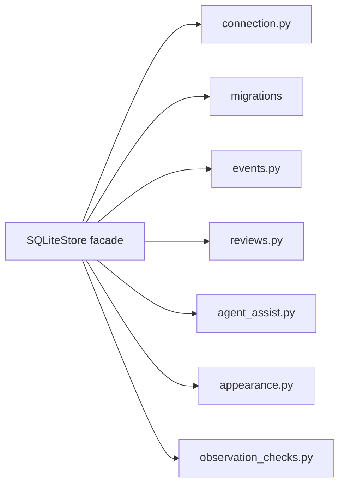

# Architecture

## System Goal

CareSight Hub turns a local Apple Silicon machine and a camera feed into a bounded care event engine. It observes configured signals, creates local structured records, and routes alerts to authorized humans without claiming medical authority.

## Core Thesis

CareSight should be judged as a chain of care, not a camera viewer:

```text
camera frames
  -> YOLO26 MLX observations
  -> deterministic event policy
  -> local SQLite memory
  -> journal and caregiver alert
  -> human acknowledgement
```

## Architecture Planes

### 1. Contract Plane

Location: `contracts/`

Owns schemas, examples, lifecycle, and fail-closed behavior for care events, camera config, routines, alert policy, and caregiver roles.

### 2. Governance and Enforcement Plane

Location: `packages/core/`

Owns TypeScript validation helpers and quality-gate logic. This plane validates contract truth but does not implement the runtime app.

### 3. Runtime Plane

Location: `apps/caresight-hub/`

Owns the Python/MLX runtime: camera handling, YOLO26 MLX execution, tracking, event engine, SQLite writes, dashboard, alerts, OBS bridge, and FaceTime handoff.

### 4. Presentation Plane

Owns local dashboard views, OBS scene selection, FaceTime handoff controls, and daily journal display. Presentation code must not become canonical truth.

### 5. Evidence and Audit Plane

Owns tests, receipts, event examples, audit notes, and reproducible validation. Claims in docs should point back to this plane or stay explicitly aspirational.

## Runtime Boundary

The Python runtime is downstream of accepted contracts:

```text
contracts/
  -> packages/core/ validation
  -> apps/caresight-hub/ runtime consumption
  -> tests/ and receipts
```

The CareSight-owned inference boundary lives under `apps/caresight-hub/caresight/runtime/inference/`.
It separates raw YOLO26 MLX `Detection` records from normalized care `Observation` records and attaches
configured camera and room metadata before downstream event policies consume them. The adapter fails closed
when the model file, import, load, or prediction path is unavailable; it must not synthesize detections for a
demo.

The tracking boundary lives under `apps/caresight-hub/caresight/runtime/tracking/`.
The v1 foundation uses a deterministic local track state machine to attach stable `track_id` evidence to
observations and event records. Tracking supports floor-stay dwell continuity through short occlusions and
an initial `missing_off_camera_extended` policy, but it does not diagnose distress or trigger dispatch.

The live event pipeline is split into explicit runtime boundaries. `runtime/live_loop.py` owns loop stop
rules, `runtime/preview/mjpeg.py` owns the detector-served local browser feed, `runtime/escalation/`
chooses local-only, dry-run, review-only, or human-approved handoff methods from persisted event context,
and `runtime/post_event_pipeline.py` owns post-event receipt formatting. `v0_floor_stay_live.py` remains
the operator CLI wrapper for the current hackathon path.

The appearance boundary lives under `apps/caresight-hub/caresight/runtime/appearance/`.
It derives coarse, same-day clothing descriptors from real event snapshots and person bounding boxes, stores
local expiring profile rows in SQLite, and exposes only bounded caregiver context. It is not face recognition,
biometric identity, named-person identification, or cross-day re-identification.

Routine event policies remain deterministic: person evidence, configured object-label evidence, configured
zone, and configured routine window. Medication and hydration events are phrased as likely observed and
remain human-confirmed workflows, not proof of administration or medical state.

Agent assistance is downstream of structured records. Agents can summarize, draft, and audit payloads with
event provenance, but cannot confirm, dismiss, delete, dispatch, diagnose, confirm medication, or inspect raw
video as the decision-maker.

Runtime validation is contract-backed but non-authoritative. `runtime-validation-receipt` records camera,
OBS/feed, Gemma, Hermes no-send, TTS-generation, database, disk, heartbeat, and demo-preflight checks while
preserving no-send/no-call/no-playback boundaries. Local MJPEG preview exposure is governed by
`local-feed-exposure`: loopback is the default, and LAN binding requires explicit operator approval, token
protection, expiration, and privacy-warning acknowledgement. Local model dependencies are governed by
`model-manifest` plus the model doctor; model availability does not grant authority to diagnose, dispatch, or
confirm medication.

SQLite storage remains the local blackbox behind the `SQLiteStore` facade, with focused helper modules for
connection handling, migrations, event identity, review lifecycle policy, agent-assist attempt identity,
appearance profile identity, and observation-check identity. Call sites should continue to use the facade
unless they are inside the storage package.



## Fail-Closed Laws

- Missing or invalid contracts block promotion.
- Unsupported actions are blocked by policy.
- Medication administration is never confirmed from vision alone.
- Emergency dispatch is not autonomous.
- Raw video is local by default and cloud upload is opt-in future work only.
